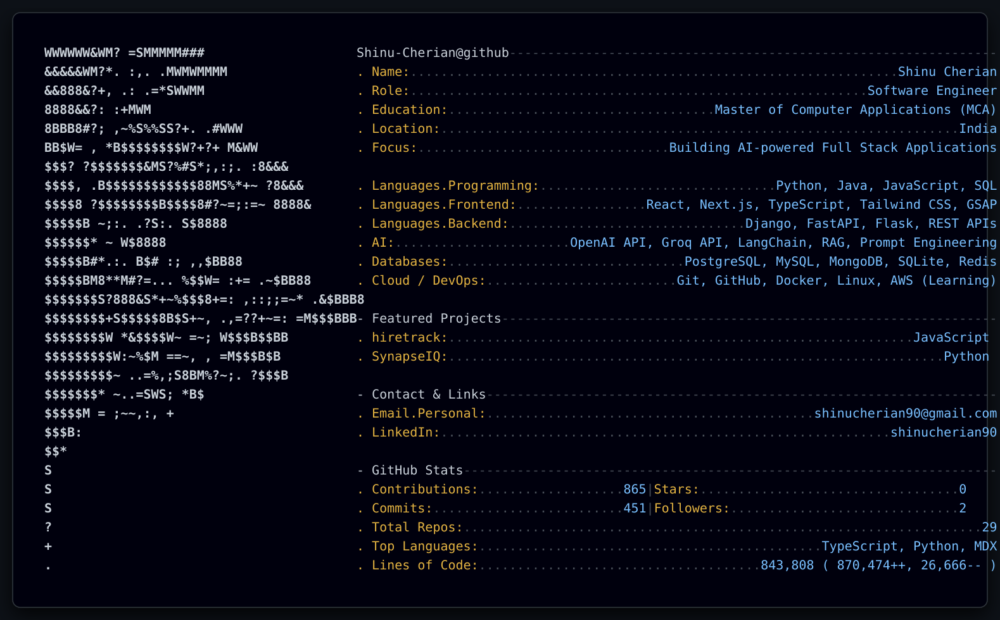

  <picture>
    <source media="(prefers-color-scheme: dark)" srcset="assets/generated/dark_v2.svg">
    <source media="(prefers-color-scheme: light)" srcset="assets/generated/light_v2.svg">
    
  </picture>

